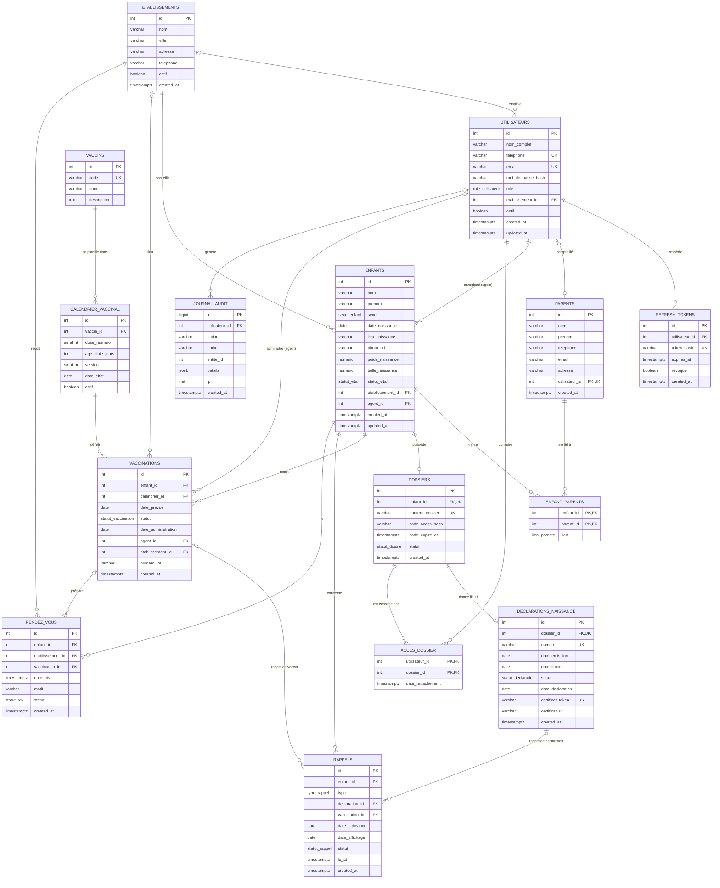

# Diagramme entité-relation (ERD)

Ce diagramme est issu du fichier [`schema.sql`](schema.sql). Il montre les 15 tables, leurs clés primaires (PK), leurs clés étrangères (FK) et leurs champs uniques (UK).

GitHub affiche directement le bloc Mermaid ci-dessous, sans image externe.

## Types énumérés

| Type | Valeurs |
|------|---------|
| `role_utilisateur` | `parent`, `agent_maternite`, `admin` |
| `sexe_enfant` | `M`, `F` |
| `statut_vital` | `vivant`, `mort_ne`, `decede` |
| `lien_parente` | `mere`, `pere`, `tuteur` |
| `statut_dossier` | `actif`, `archive` |
| `statut_declaration` | `en_attente`, `declaree`, `hors_delai` |
| `statut_vaccination` | `a_venir`, `effectue`, `en_retard` |
| `type_rappel` | `declaration`, `vaccin` |
| `statut_rappel` | `a_venir`, `affiche`, `lu`, `clos` |
| `statut_rdv` | `planifie`, `honore`, `manque`, `annule` |

## Contraintes de cohérence

Ces règles sont garanties par la base elle-même, même si l'application contient une erreur.

| Table | Contrainte | Règle |
|-------|------------|-------|
| `utilisateurs` | `chk_agent_etablissement` | Un agent de maternité est obligatoirement rattaché à un établissement. |
| `enfants` | `chk_date_naissance` | La date de naissance ne peut pas être dans le futur. |
| `declarations_naissance` | `chk_declaree_date` | Une déclaration au statut `declaree` doit avoir une date de déclaration. |
| `vaccinations` | `chk_effectue_date` | Une vaccination `effectue` doit avoir une date d'administration. |
| `vaccinations` | `uq_enfant_calendrier` | Un enfant ne peut recevoir qu'une fois la même dose du calendrier. |
| `calendrier_vaccinal` | `age_cible_jours >= 0` et `dose_numero > 0` | Âge cible et numéro de dose cohérents. |
| `calendrier_vaccinal` | `uq_vaccin_dose_version` | Une seule ligne par vaccin, dose et version du calendrier. |
| `rappels` | `chk_rappel_cible` | Un rappel de type `declaration` pointe vers une déclaration, un rappel de type `vaccin` pointe vers une vaccination, jamais les deux. |

## Règles de suppression des clés étrangères

- **`ON DELETE CASCADE`** : la suppression d'un enfant supprime ses dossiers, vaccinations, rappels, rendez-vous et liens avec les parents. La suppression d'un utilisateur supprime ses jetons et ses accès aux dossiers.
- **`ON DELETE SET NULL`** : la suppression d'un établissement ne supprime pas ses utilisateurs, et la suppression d'un compte utilisateur conserve la fiche du parent (`parents.utilisateur_id` devient nul).
- **Sans action (par défaut)** : un établissement ou un agent référencé par un enfant ne peut pas être supprimé, ce qui protège l'historique.

## Automatismes

| Déclencheur | Rôle |
|-------------|------|
| `trg_declaration_date_limite` | À la création d'une déclaration, calcule la date limite : date de naissance + 30 jours. |
| `trg_enfants_updated` et `trg_utilisateurs_updated` | Mettent à jour `updated_at` à chaque modification. |

Deux vues alimentent les statistiques : `v_stats_natalite` (naissances par mois et par établissement, garçons et filles) et `v_stats_mortalite` (mort-nés et décès par mois et par établissement).
